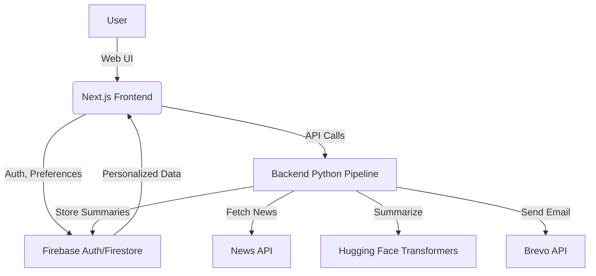

# VeridianAI: Personalized AI-Powered Newsletters

> **Personalized AI Newsletters Tailored for You**

---

## Overview

VeridianAI is an end-to-end platform that delivers personalized, AI-generated news summaries to users based on their selected topics. The system leverages state-of-the-art NLP models and a modern web stack to automate news aggregation, summarization, and delivery, providing a seamless and engaging user experience.

---

## Table of Contents

- [Features & MVP](#features--mvp)
- [Tech Stack](#tech-stack)
- [Architecture](#architecture)
- [Screenshots & Suggested Images](#screenshots--suggested-images)
- [Getting Started](#getting-started)
- [Folder Structure](#folder-structure)
- [For Recruiters](#for-recruiters)
- [License](#license)

---

## Features & MVP

**Minimum Viable Product (MVP):**

- **User Authentication:** Secure sign-up, login, and session management (Firebase Auth).
- **Topic Selection:** Users choose their preferred news topics (e.g., tech, science, sports).
- **Automated News Fetching:** Daily aggregation of news articles from external APIs.
- **AI Summarization:** Use of Hugging Face Transformers to generate concise, high-quality summaries.
- **Duplicate Detection:** Semantic similarity checks to avoid redundant content.
- **Personalized Newsletters:** Each user receives a custom newsletter with summaries for their chosen topics.
- **Newsletter Delivery:** Newsletters are stored in Firestore and can be sent via email (Brevo integration).
- **Modern UI:** Responsive, animated React/Next.js frontend with light/dark mode.

---

## Tech Stack

### **Frontend**
- **Framework:** Next.js (React 19)
- **Styling:** Tailwind CSS, Framer Motion (animations)
- **State/Auth:** React Context, Firebase Auth
- **Deployment:** Vercel

### **Backend**
- **Language:** Python 3
- **AI/NLP:** Hugging Face Transformers (`facebook/bart-large-cnn`), Sentence Transformers (`all-MiniLM-L6-v2`)
- **News Parsing:** newspaper3k
- **Database:** Google Firestore (via `firebase-admin`)
- **Environment:** python-dotenv
- **Email Delivery:** Brevo (Sendinblue) API

---

## Architecture



---

## Screenshots


**Login Screen**


**Settings Page**


**Newsletter Early Examples. (Subject to change with each release)**


Currently working on implementing the images into the newsletter as well as updating the structure of the newsletter to fit the theme of the website

---

## Getting Started

### **Backend**

1. `cd backend`
2. Install dependencies:
   ```bash
   pip install -r requirements.txt
   ```
3. Set up your `.env` with Firebase and API keys.
4. Run the pipeline:
   ```bash
   python ai_pipeline.py
   ```

### **Frontend**

1. `cd frontend`
2. Install dependencies:
   ```bash
   npm install
   ```
3. Start the dev server:
   ```bash
   npm run dev
   ```
4. Visit [http://localhost:3000](http://localhost:3000)

---

## Folder Structure

```
AI Newsletter Project/
  backend/         # Python AI pipeline, summarization, Firestore integration
  frontend/        # Next.js React app, user auth, topic selection, UI
```

---

## For Recruiters

- **Software Engineering:** Demonstrates full-stack skills, cloud integration, and modern UI/UX.
- **AI Engineering:** End-to-end NLP pipeline, model orchestration, and scalable summarization.
- **Extensible:** Easily add new topics, models, or delivery channels.

---

## License

MIT 
